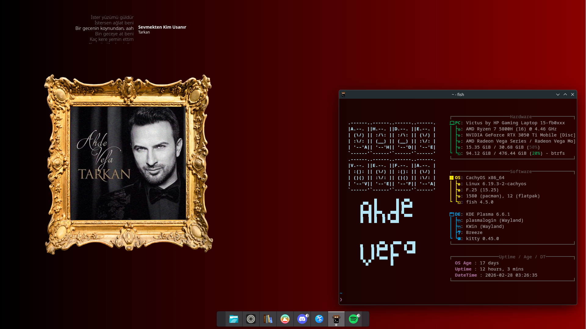

  <h1>Tarkan Rice for KDE Plasma</h1>

  

  ---

  

    
    
    
  

<h2 align="center">Details<h2>

<table align="center">
  <tr>
    <td><b>Renk Şeması</b></td>
    <td>Breeze Dark</td>
  </tr>
  <tr>
    <td><b>Duvar Kağıdı</b></td>
    <td><code>wallpaper.png</code></td>
  </tr>
  <tr>
    <td><b>Terminal</b></td>
    <td>Kitty</td>
  </tr>
  <tr>
    <td><b>Kitty Teması</b></td>
    <td>3024 Night</td>
  </tr>
  <tr>
    <td><b>Fastfetch Config</b></td>
    <td><code>fastfetch-config.jsonc</code></td>
  </tr>
  <tr>
    <td><b>Fastfetch Logo</b></td>
    <td><code>fastfetch-logo.txt</code></td>
  </tr>
</table>

---

